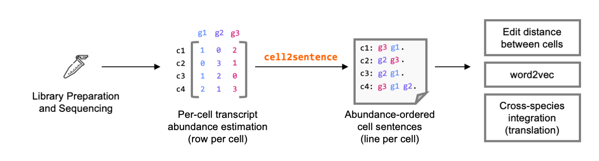

# cell2sentence

Reframing cells as sentences of genes, ordered by expression. Please
read the manuscript on bioRxiv for methodological details and examples.

(https://www.biorxiv.org/content/10.1101/2022.09.18.508438)

## Stable Setup

Install `cell2sentence` from PyPI with

    pip install cell2sentence

## Convert Anndata Object to Cell Sentences

After your data is loaded into a standard AnnData `adata` object, you may 
create a cell2sentence object with:

    import cell2sentence as cs

    csdata = cs.transforms.csdata_from_adata(adata)

and generate a list of cell sentences with:

    sentences = csdata.create_sentence_lists()

A tutorial script showing how to use pretrained word vectors to analyze
the `pbmc3k` dataset used by Seurat and scanpy in their guided clustering
tutorials is available at 
[`tutorials/pbmc3k_cell_sentences.py`](tutorials/pbmc3k_cell_sentences.py)

## Development Setup

Create a conda environment using `python3` using 
[anaconda](https://docs.anaconda.com/anaconda/install/) with:

    conda create -n cell2sentence python=3.8

and activate the environment with

    conda activate cell2sentence

finally, you can install the latest development version of `cell2sentence` by
running

    make install

which simply uses `pip -e`.

## Loading Data

All data used in the bioRxiv manuscript are publicly available, and details
are outlined in the [`DATA.md`](DATA.md) file in this repository.
